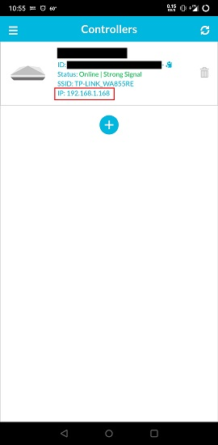
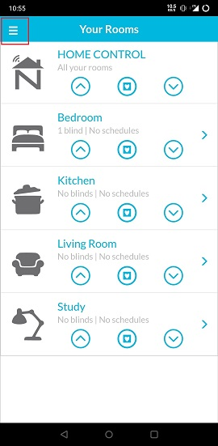
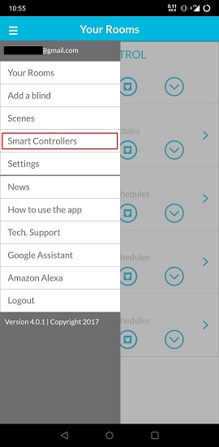
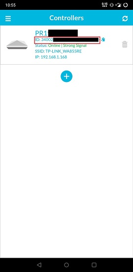
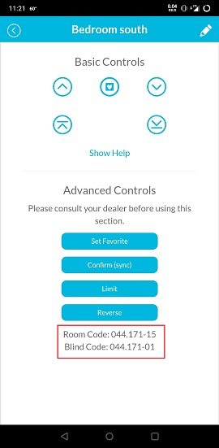
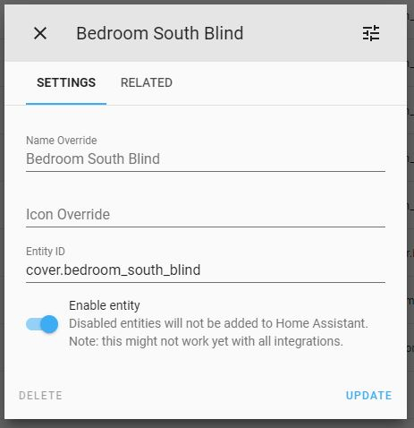
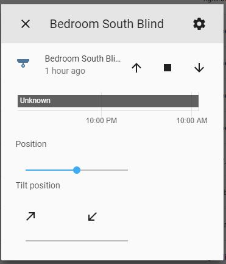

# Custom Component for NeoSmartBlinds Integration on Home Assistant

The NeoSmartBlinds platform allows you to control a NeoSmartBlind / group of NeoSmartBlinds via a NeoSmartBlinds controller.

There is currently support for the following device types within Home Assistant:

-   Cover

## Installation

To begin with it is recommended you ensure your NeoSmartBlinds controller has a static IP addresses, you may need to configure this via your routers DHCP options.

1. Download the latest release from: https://github.com/mtgeekman/Home_Assistant_NeoSmartBlinds/releases
2. Extract the file
3. Copy the **neosmartblinds** folder to your **config/custom_components/** directory
4. Go to Config -> Server Controls -> Under "Server Management" click restart
5. Go to configuration example for how to setup your config.


# Cover Configuration 

### Example of basic configuration.yaml
```
cover:
  - platform: neosmartblinds
    name: Blind One
    host: 192.168.0.13
    hub_id: 000000000000000000000000
    protocol: http
    port: 8838
    blind_code: 021.230-04
    close_time: 30
    rail: 1
    percent_support: 1
```

## Configuration variables

cover:

**platform** (String)(Required) <br>
Must be set to neosmartblinds

**host** _(String)(Required)_<br>
The IP of the NeoSmartBlinds controller, e.g., 192.168.0.10.

Getting the IP:




**hub_id** _(String)(Required)_<br>
The 24 character device ID of the Smart Blinds Hub, found in the APP





**protocol** _(String)(Required)_<br>
The protocol to use for sending commands. (http, tcp)

**port** _(String)(Required)_<br>
Port use for the connection.  for TCP use 8839, for HTTP use 8838

**name** _(String)(Required)_<br>
The name you would like to give to the NeoSmartBlind.

**blind_code** _(String)(Required)_<br>
The blind code. - This is available from the NeoSmartBlind app<br>
Getting the codes: 



- Room Code: will control all blinds in that room
- Blind Code: will controll only that blind

**“​ID1.ID2-CHANNEL"**<br>
**“ID1”** : controller byte 1, from integer “000” to “255”<br>
**“.”** : address separator<br>
**“ID2”** : controller byte 2, from integer “000” to “255”<br>
**“-”** : channel separator<br>
**“CHANNEL”** : channel, individual channel from integer “01” to “14”, use channel “15” for a group

**close_time** _(String)(Required)_<br>
Time taken in seconds to close this blind (use a stop watch to measure)

**rail** _(string)_<br>
Rail Number used to determine top or bottom rail on top down/bottom up blinds. <br>
1 = Top Rail<br>
2 = Bottom Rail

**percent_support** _(int)_<br>
Determines if the blinds/controller support providing a percentage to set the blind position directly. <br>
0 = No support (Default)<br>
1 = Supported


Entity Options in UI:



Entity Control allows for fine adjustment and extra controls:



Lovelace ui panel provides basic control


## Supported features

**Open**
Up

**Close**
Down

**Tilt-Up**
Micro-Up

**Tilt-Down**
Micro-Down

**Set-Position & Favourite Position** - please note this is calculated using the close_time

   ### Setting the position if "percent_support" is disabled:
   
   **<= 49** will move the blind down, this means set position 25, moves the blind down and stops after 50% of your close_time
      
   **>=52** will move the blind up, this means set position 75, moves the blind up and stops after 50% of your close_time
   
   **==50** will set your blind to its stored first favourite position 

   **==51** will set your blind to its stored second favourite position 

   ### Setting the position if "percent_support" is disabled:
   
   **Setting position** Use the position slider to select how 
      
   **Setting favorite postion 1** Use the tilt slider to select a value less than 50
   
   **Setting favorite postion 2** Use the tilt slider to select a value greater than 50

